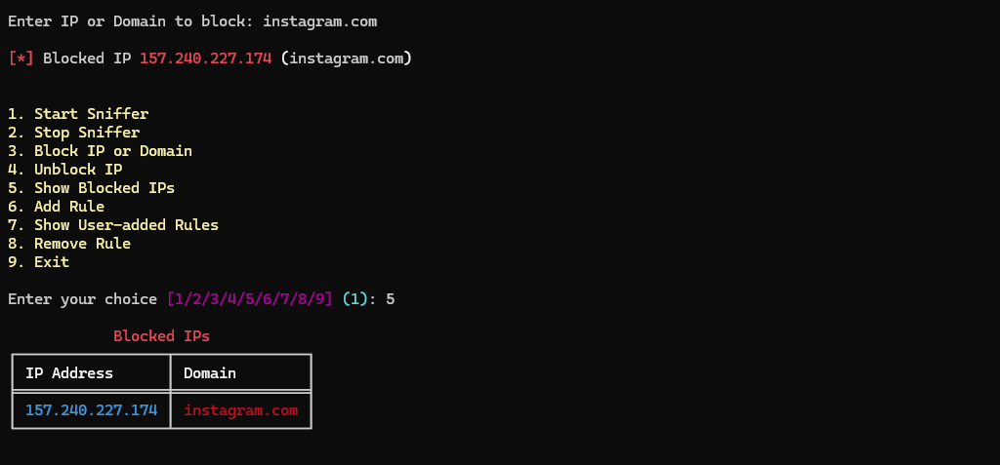

# Python Firewall For Linux OS

This project is a simple firewall utility built using Python and the Scapy library. It allows you to monitor network traffic, block or unblock IP addresses and domains, and manage custom firewall rules.

## Features

- Monitor network traffic
- Block/unblock IP addresses and domains
- Add custom firewall rules
- Display currently blocked IPs
- User-friendly command-line interface

## Requirements

- Python 3.x
- Scapy library
- Rich library
- Dig utility (for resolving domains)
- iptables (for managing firewall rules)
- **Linux Operating System**

## Installation

1. **Clone the repository:**

   ```bash
   git clone https://github.com/yourusername/python-firewall.git
   cd python-firewall
   ```

2. **Install the required libraries:**

   ```bash
   pip install scapy rich
   ```

3. **Ensure `dig` and `iptables` are installed on your system:**

   - On Ubuntu/Debian:

     ```bash
     sudo apt-get install dnsutils iptables
     ```

   - On Fedora/CentOS:

     ```bash
     sudo yum install bind-utils iptables
     ```

## Usage

1. **Run the firewall script:**

   ```bash
   python firewall.py
   ```

2. **Follow the on-screen menu to interact with the firewall:**

   - **Start Sniffer:** Begin monitoring network traffic.
   - **Stop Sniffer:** Stop monitoring network traffic.
   - **Block IP or Domain:** Block a specific IP address or domain.
   - **Unblock IP:** Unblock a specific IP address.
   - **Show Blocked IPs:** Display the list of currently blocked IP addresses and domains.
   - **Add Rule:** Add a custom firewall rule.
   - **Show User-added Rules:** Display the list of user-added firewall rules.
   - **Remove Rule:** Remove a specific user-added rule.
   - **Exit:** Exit the application.

## Screenshots

### Main Menu


### Blocked IPs List



### User-added Rules


## Contributing

Contributions are welcome! Please open an issue or submit a pull request for any enhancements or bug fixes.

## License

This project is licensed under the MIT License. See the `LICENSE` file for more details.
